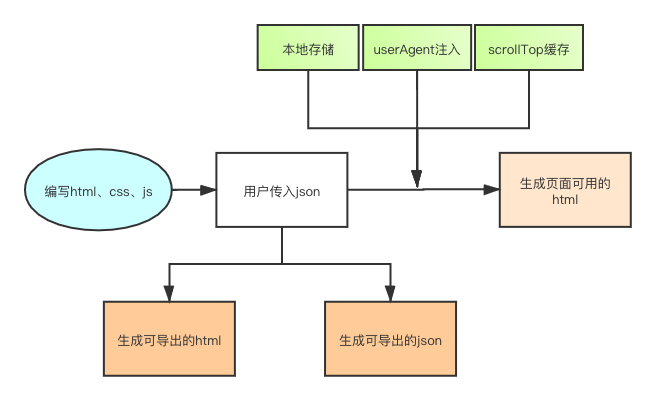

<p align="center">
 
 <h2 align="center">Qieditor</h2>
 <p align="center">Qieditor 是一个 HTML 页面生成器：通过配置形式快速生成页面的可视化编辑工具，做到一次开发、多次生成，简化开发流程，提高开发流水线的生产效率。</p>
</p>
<p align="center">
  <a href="https://github.com/Qionline/Qieditor/issues/new/choose">提供新点子 💡</a>
  |
  <a href="https://github.com/Qionline/Qieditor/issues/new/choose">报告BUG 🐛</a>
  |
  <a href="https://github.com/Qionline/Qieditor/pulls">提交PR 🔀</a>
</p>

<p align="center">
  点击 <a href="https://qi.byeguo.cn/">🥳 立即使用 🥳</a> 即可体验 Qieditor 的完整功能。
</p>

## 功能介绍

目前 Qieditor 支持如下功能：

**基础功能：**

- [x] 配置文件导入导出
- [x] 生成可用的 HTML 页面
- [x] 组件客制化编辑
- [x] 拖拽组件自定义顺序

**增强功能：**

- [x] ios / android 机型模拟：用于解决根据 ios/android 机型触发不同页面逻辑的需求。
- [x] 本地自动存储：为解决编辑过程中浏览器闪退等导致编辑内容丢失的问题。

## 文件配置项

Qieditor 通过解析导入.json 的配置文件来生成可视化编辑页面，配置文件规则如下：

```json
{
  "filename": "导出html时文件名称",
  "global": {
    "title": "tab栏中的名称，即document.title",
    "direction": "ltr",
    "bodyColor": "#e07300",
    "css": "body{color:#fff}",
    "js": "",
    "params": {
      "globalTitle": {
        "type": "text",
        "title": "所有组件均可访问的变量",
        "value": "我是globalTitle"
      }
    }
  },
  "main": [
    {
      "id": 1,
      "name": "侧边栏中显示的内容",
      "params": {
        "aParam": {
          "type": "text",
          "title": "右侧组件配置中显示的内容",
          "value": "可编辑的值：我是aParam"
        }
      },
      "htmlstr": "<div>我是main <%aParam%> </div>"
    }
  ],
  "component": [
    {
      "id": 2,
      "name": "与main相同",
      "params": {},
      "htmlstr": "<div><%globalTitle%>我是component</div>"
    }
  ]
}
```

你可以尝试创建 json 文件并将此导入 Qieditor 中，快速的熟悉配置的用法。

### 参数类型

params 中，type 目前支持 `text`、`radio` 两种类型

**`text` 参数：** 
- type: `"text"`
- title: `string`
- value: `string`

**`radio` 参数：** 
- type: `"radio"`
- title: `string`,
- value: `string`
- radioArr: `string[]`


### 注意

这里主要说几项需要注意的配置：

- `global.direction`: 该配置选项为`ltr`或者`rtl`，是用于调整阅读习惯的配置选项。
- `global.css`与`global.js`: 全局的 css 与 js，js 会引入于 dom 加载完成后。
- main 与 component 中: 组件项的结构是相同的，但是注意 id 不能重复，这是用于区分不同组件的标识。
- params 中，key 是用户自定义的，其值会在渲染 htmkstr 时通过<%key%>的形式使用。


## 解析流程

解析流程如图所示：

1. 首先开发者编写可用的配置文件
2. 将配置文件导入进 Qieditor
3. Qieditor 生成可导出的 html
4. 与此同时，Qieditor 会进行本地存储、注入展示页面可用的 js 脚本文件，进而生成可预览的 html
5. 此时交予使用者进行页面配置、在配置完毕后生成可用的 html 文件。



## 最后

本项目完全开源，如果你有好的想法，或者在使用过程中遇到了什么问题，欢迎通过 issure 与我交流。

都看到这里了希望你可以点一个 star🌟 支持一下～
